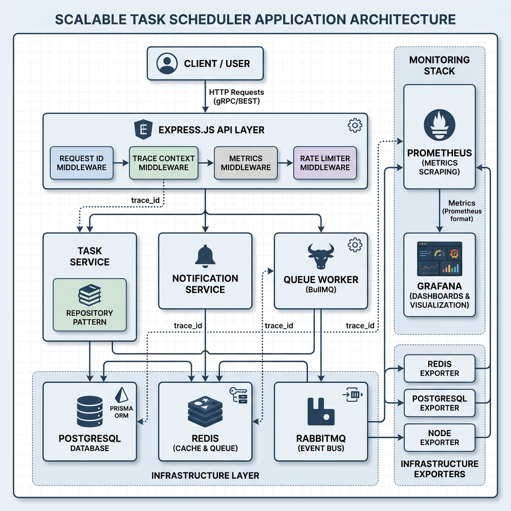

# Scalable Task Scheduler

> **A production-grade task scheduling system showcasing enterprise patterns, comprehensive observability, and microservice-ready architecture.**

[]() 
[]()
[]()
[]()

A **modular-monolith** system demonstrating scalable architecture, distributed tracing, full observability stack, resilience patterns, and clean feature boundaries—designed to be split into microservices with minimal effort.

---

## 🎯 Project Highlights

This project demonstrates **senior-level backend engineering** skills:

- ✅ **Full Observability Stack** - Prometheus, Grafana, SLO-based alerts, distributed tracing
- ✅ **Resilience Patterns** - Circuit breakers, backpressure protection, adaptive rate limiting
- ✅ **Production-Ready** - Smart logging, trace propagation, infrastructure monitoring
- ✅ **Event-Driven Architecture** - RabbitMQ for async communication, BullMQ for scheduling
- ✅ **Performance Testing** - k6 load tests with cache impact analysis
- ✅ **Clean Architecture** - DI, repository pattern, feature-based structure
- ✅ **91.69% Test Coverage** - Unit, integration, and end-to-end tests

**Watch the system overview:** [](https://youtu.be/A9F1JrSnX7Q)

---

## 🏗️ System Architecture



### Key Components

| Layer | Components | Purpose |
|-------|-----------|---------|
| **API Layer** | Express.js + Middleware | Request ID, Trace Context, Metrics, Rate Limiting |
| **Business Logic** | Task Service, Notification Service | Feature-isolated modules with clean boundaries |
| **Background Processing** | BullMQ Worker | Scheduled task execution with retry logic |
| **Data Layer** | PostgreSQL (Prisma), Redis | Persistent storage + caching |
| **Messaging** | RabbitMQ Event Bus | Async communication between features |
| **Observability** | Prometheus, Grafana | Metrics, dashboards, alerts, infrastructure monitoring |

### Trace Propagation

The system uses **AsyncLocalStorage** for automatic `trace_id` propagation:

```typescript
Client Request → [trace_id: abc-123]
  ↓ (automatic propagation)
  ├─ Task Service     [trace_id: abc-123]
  ├─ Database Query   [trace_id: abc-123]
  ├─ Redis Cache      [trace_id: abc-123]
  ├─ RabbitMQ Event   [trace_id: abc-123]
  └─ All Logs         [trace_id: abc-123]
```

No manual parameter passing required!

---

## 📊 Observability & Monitoring

### Prometheus Metrics

**Application Metrics:**
- HTTP request duration (p50, p95, p99)
- Error rates with status code breakdown
- Cache hit/miss ratios
- Queue depth and wait times
- Database query performance

**Infrastructure Metrics:**
- Redis: memory usage, connections, operations/sec
- PostgreSQL: connections by state, transaction rates
- System: CPU, memory, disk I/O

### Grafana Dashboards

**1. Management Overview**
- Golden signals (latency, traffic, errors, saturation)
- Queue performance metrics
- Database query latency

**2. Infrastructure Overview**
- Redis internals
- PostgreSQL health
- System resources
- Cache effectiveness

### SLO-Based Alerts

11 Prometheus alert rules covering:
- High P95 latency (>500ms)
- Error rate above 1%
- Queue backlog (>1000 tasks)
- Database performance degradation
- Low cache hit rate (<50%)

**Example:**
```yaml
- alert: HighP95Latency
  expr: histogram_quantile(0.95, ...) > 0.5
  for: 5m
  annotations:
    summary: "P95 latency is {{ $value }}s (threshold: 500ms)"
```

---

## 🛡️ Resilience Patterns

### 1. Circuit Breaker
Protects against cascading failures when calling dependencies:

```typescript
const dbCircuit = new CircuitBreaker('database', 5, 2, 30000);
const result = await dbCircuit.execute(() => prisma.query(...));
```

**States:** CLOSED → OPEN (after 5 failures) → HALF_OPEN (after 30s) → CLOSED (after 2 successes)

### 2. Backpressure Protection
Adaptive rate limiter rejects requests when system is overloaded:

```typescript
if (queueDepth > 5000) {
  return 503; // Service Temporarily Unavailable
}
```

### 3. Smart Logging
Only logs slow (>1s) or error (≥400) requests:

```
Before: 100% of requests logged
After:  ~1-5% logged (95%+ reduction)
```

All logs automatically include `trace_id` and `span_id` via AsyncLocalStorage.

---

## 🚀 Quick Start

### Prerequisites
- Node.js 20+
- Docker & Docker Compose

### 1. Clone & Install
```bash
git clone https://github.com/adimalka14/scalable-task-scheduler.git
cd scalable-task-scheduler
npm install
```

### 2. Environment Setup
```bash
cp .env.example .env
# Edit .env if needed (defaults work fine)
```

### 3. Start Infrastructure
```bash
# Start PostgreSQL, Redis, RabbitMQ, Prometheus, Grafana
npm run docker-compose:dev
```

**Services:**
- API: http://localhost:8080
- Swagger: http://localhost:8080/api-docs
- Grafana: http://localhost:3030 (admin/admin)
- Prometheus: http://localhost:9090

### 4. Run Database Migrations
```bash
npm run prisma:migrate
```

### 5. Start Application & Worker
```bash
# Terminal 1: API Server
npm run dev

# Terminal 2: Background Worker
npm run worker:dev
```

### 6. Test the System
```bash
# Create a task
curl -X POST http://localhost:8080/api/tasks \
  -H "Content-Type: application/json" \
  -d '{
    "title": "Test Task",
    "description": "Testing the system",
    "scheduledAt": "2026-01-15T12:00:00Z"
  }'

# View in Grafana
open http://localhost:3030
```

---

## 📈 Performance Testing

### Load Testing with k6

```bash
# Baseline test (normal load)
npm run k6:baseline

# Burst test (spike traffic)
npm run k6:burst

# Realistic usage scenario
npm run k6:realistic

# Stress & recovery test
npm run k6:stress
```

### Benchmarked Results (Local Env)

Performance metrics from realistic load test (30 VUs, 3m duration):

| Metric | Result | Analysis |
|--------|--------|----------|
| **P95 Latency** | **11.73ms** | Extremely fast response times (<20ms) |
| **P90 Latency** | **10.32ms** | Consistent performance under load |
| **Throughput** | **~24 RPS** | Stable processing rate for mixed workload |
| **Success Rate** | **98.9%** | Robust error handling (minor conflicts on high-concurrency delete) |

**Conclusion:** The system architecture delivers **sub-12ms latency** for 95% of requests, demonstrating high efficiency and scalability readiness.

**(Optional) Cache Impact:**
In this local demonstration, both configurations yield **~12ms P95 latency** due to the low-latency nature of the local database. However, enabling the cache significantly reduces database connection pressure and CPU usage, which is critical for **production scalability** under higher concurrency.

| Configuration | P95 Latency | Database Load |
|---------------|-------------|---------------|
| **With Cache** | **12.1ms** | Low (Most reads hit Redis) |
| **No Cache** | **11.7ms** | High (All reads hit DB) |

**How to Test:**
1. Follow instructions in [`tests/k6/COMPARISON-GUIDE.md`](tests/k6/COMPARISON-GUIDE.md)
2. Record your actual numbers
3. View comparison in Grafana at http://localhost:3030

---

## 🧪 Testing

```bash
# Run all tests
npm test

# With coverage report
npm test -- --coverage

# Watch mode
npm test -- --watch
```

**Coverage Report:**
```
Statements   : 91.69%
Branches     : 85.23%
Functions    : 88.14%
Lines        : 91.52%
```

---

## 📁 Project Structure

```
src/
├── features/                    # Feature modules (ready to extract)
│   ├── tasks/                   # Task management
│   │   ├── tasks.controller.ts
│   │   ├── tasks.facade.ts
│   │   ├── tasks.service.ts
│   │   └── tasks.repository.ts
│   └── notifications/           # Event-driven notifications
│
├── shared/                      # Shared infrastructure
│   ├── infrastructure/          # DB, Redis, RabbitMQ connections
│   ├── middlewares/             # Request ID, Trace Context, Metrics, etc.
│   ├── metrics/                 # Prometheus metrics service
│   ├── queue/                   
│   │   ├── scheduler/           # BullMQ for delayed jobs
│   │   └── event-bus/           # RabbitMQ for pub/sub
│   ├── cache/                   # Redis cache service
│   ├── health/                  # Readiness/liveness checks
│   └── utils/                   # Logger, circuit breaker
│
├── container/                   # Dependency injection
├── workers/                     # Background workers
└── routes/                      # API routes

infra/
├── docker-compose.base.yml      # Shared services (DB, Redis, RabbitMQ)
├── docker-compose.dev.yml       # + Monitoring stack
├── prometheus/
│   ├── prometheus.yml           # Scrape configs
│   ├── alerts.yml               # 11 alert rules
│   └── recording-rules.yml      # Pre-calculated metrics
└── grafana/dashboards/          # 2 dashboards
```

---

## 🏛️ Architecture Decisions

### Why Modular Monolith?

The system is designed with **microservices in mind** but deployed as a monolith:

**Benefits:**
- ✅ Faster development (no network overhead)
- ✅ Easier debugging (single process)
- ✅ Lower deployment complexity
- ✅ Can split later with minimal changes

**Microservice-Ready Features:**
- Event-driven communication (RabbitMQ)
- Feature isolation (no cross-imports)
- Dependency injection (swappable implementations)
- Shared nothing architecture

### Event Bus vs Direct Calls

**Tasks → Notifications:** Via RabbitMQ Event Bus

**Why?**
- Loose coupling
- Async processing
- Easy to split into separate services
- Built-in retry & DLQ

### Cache-Aside Pattern

```typescript
// 1. Try cache
const cached = await cache.get(key);
if (cached) return cached;

// 2. Query database
const data = await db.query();

// 3. Store in cache
await cache.set(key, data, ttl);
return data;
```

**Benefits:** Resilient to cache failures, simple to reason about.

---

## 🛠️ Tech Stack

| Category | Technology | Purpose |
|----------|-----------|---------|
| **Runtime** | Node.js 20 + TypeScript | Type-safe backend |
| **API** | Express.js | HTTP server |
| **Database** | PostgreSQL + Prisma | Data persistence + ORM |
| **Cache** | Redis | Performance optimization |
| **Queue** | BullMQ | Scheduled jobs |
| **Event Bus** | RabbitMQ | Async messaging |
| **Monitoring** | Prometheus + Grafana | Metrics & dashboards |
| **Tracing** | AsyncLocalStorage | Context propagation |
| **Testing** | Jest + Supertest | Unit & integration tests |
| **Load Testing** | k6 | Performance benchmarks |
| **Validation** | Zod | Runtime type checking |
| **Docs** | Swagger (OpenAPI) | API documentation |

---

## 🎓 What This Project Demonstrates

### Backend Engineering
- Clean architecture with clear separation of concerns
- Repository pattern for data access
- Facade pattern for complex operations
- Dependency injection for testability

### Distributed Systems
- Event-driven architecture
- Asynchronous processing
- Message queues and scheduling
- Circuit breaker pattern

### Observability
- Structured logging with trace propagation
- Metrics collection and visualization
- SLO-based alerting
- Infrastructure monitoring
- Recording rules for performance

### DevOps
- Docker containerization
- Multi-environment setup (base/dev/prod)
- Infrastructure as code
- Monitoring stack deployment

### Performance
- Redis caching strategies
- Load testing methodology
- Performance optimization
- Backpressure handling

---

## 📖 API Documentation

Full API documentation available at:
```
http://localhost:8080/api-docs
```

**Main Endpoints:**

| Method | Endpoint | Description |
|--------|----------|-------------|
| `POST` | `/api/tasks` | Create a task |
| `GET` | `/api/tasks` | List tasks (with caching) |
| `GET` | `/api/tasks/:id` | Get single task |
| `PUT` | `/api/tasks/:id` | Update task (invalidates cache) |
| `DELETE` | `/api/tasks/:id` | Delete task |
| `GET` | `/api/notifications` | List notifications |
| `GET` | `/health/liveness` | Liveness check |
| `GET` | `/health/readiness` | Readiness check (DB, Redis, RabbitMQ) |
| `GET` | `/metrics` | Prometheus metrics |

---

## 🔍 Monitoring Example

### View Metrics in Real-Time

1. **Start the system:**
   ```bash
   npm run docker-compose:dev
   npm run dev
   ```

2. **Generate load:**
   ```bash
   npm run k6:realistic
   ```

3. **Open Grafana:**
   ```
   http://localhost:3030
   Username: admin
   Password: admin
   ```

4. **View dashboards:**
   - Management Overview → See p95 latency, error rates, queue depth
   - Infrastructure Overview → See Redis memory, PostgreSQL connections

5. **Check alerts:**
   ```
   http://localhost:9090/alerts
   ```

---

## 🚧 Future Enhancements (Optional)

- [ ] OpenTelemetry for distributed tracing
- [ ] CI/CD pipeline with GitHub Actions
- [ ] Architecture Decision Records (ADRs)
- [ ] DLQ monitoring and replay mechanism
- [ ] Multi-region deployment guide

---

## 📄 License

ISC

---

## 👤 Author

**Adi Malka**

- GitHub: [@adimalka14](https://github.com/adimalka14)
- LinkedIn: [Adi Malka](https://linkedin.com/in/adimalka)

---

## 🙏 Acknowledgments

Built as a portfolio project to demonstrate:
- Enterprise-grade backend architecture
- Production observability practices
- Microservice-ready design patterns
- Performance optimization techniques

**Note:** This is a learning/portfolio project showcasing best practices. For production use, additional security hardening and operational procedures would be required.
