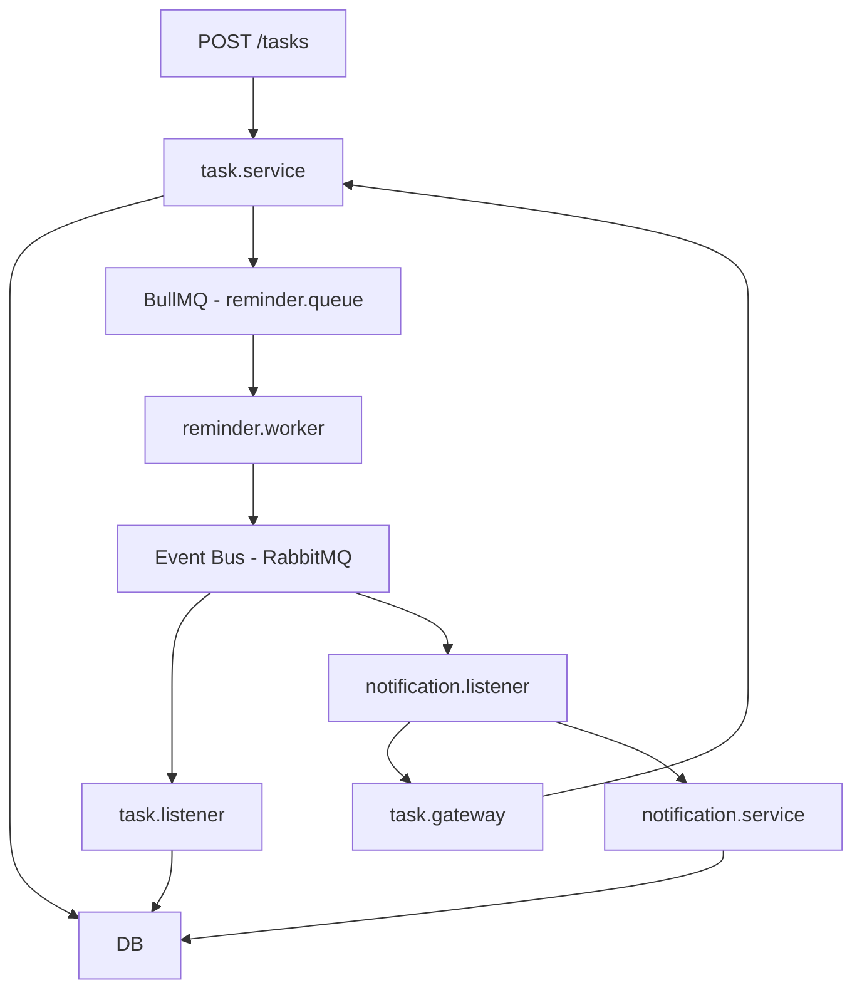

# Scalable Task Scheduler 🧠⏰

A production-grade demo that showcases how to design a **modular monolith** with:
- 🔁 BullMQ for delayed jobs and scheduling
- 🐇 RabbitMQ as an event bus (fanout pub/sub)
- 🧱 Feature-Based Structure (FBS)
- 🧩 Dependency Injection (DI)
- 🚀 Redis as both cache and queue backend
- 🧪 Support for CI/CD, testing, and scalable async processing

---

## 📦 Features

| Feature | Description |
|--------|-------------|
| `Task` | User can schedule a personal task with a due date |
| `Reminder` | Background worker queues the task and emits a `task.ready` event |
| `Notification` | Listens to the event, loads the task from DB, notifies user (console/email/db) |

---

## 🧠 Architecture Overview



---

## 📁 Project Structure

```
src/
├── features/
│   ├── task/
│   ├── reminder/
│   ├── notification/
├── infra/
│   ├── db/
│   ├── cache/
│   ├── event-bus/
│   ├── queues/
├── gateways/
├── config/
├── app.ts
├── server.ts
```

---

## 🛠️ Tech Stack

- Node.js + TypeScript
- Express (API layer)
- BullMQ (reminder queue)
- RabbitMQ (event bus)
- Redis
- Prisma (ORM)
- Jest (testing)
- Docker & GitHub Actions (CI/CD)

---

## 🚀 Getting Started

Coming soon…

---

## License

MIT
